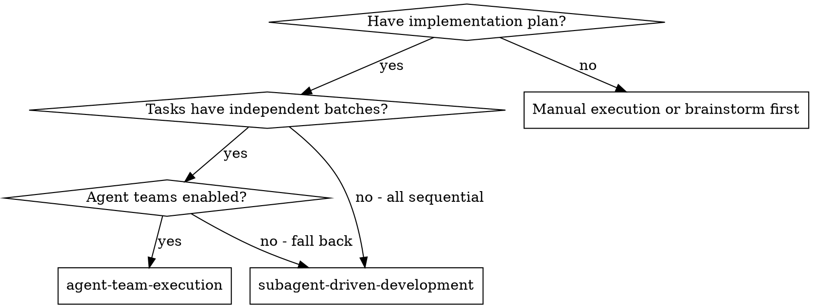
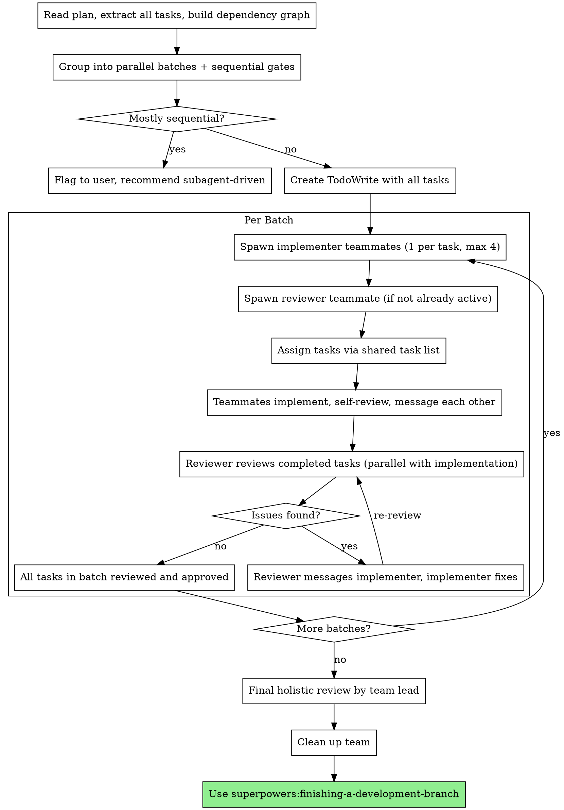

# Agent Team Execution

Execute a plan by creating a Claude Code agent team: implementer teammates work independent tasks in parallel, a dedicated reviewer teammate handles spec compliance and code quality review, and the team lead coordinates batches and gates.

**Why agent teams:** Subagent-driven development executes tasks sequentially — one at a time with review between each. Agent teams unlock parallel execution: independent tasks run concurrently across multiple teammates who communicate directly with each other. Use this when the plan has batches of tasks that don't share files.

**Core principle:** Dependency analysis + parallel batches + persistent reviewer teammate = faster execution of plans with independent tasks

**Announce at start:** "I'm using the agent-team-execution skill to implement this plan with an agent team."

## Prerequisites

- Claude Code v2.1.32+
- `CLAUDE_CODE_EXPERIMENTAL_AGENT_TEAMS` enabled in settings.json or environment

If agent teams are not available, fall back to subagent-driven-development and inform the user.

## When to Use



## The Process



## Phase 1: Plan Analysis

Read the plan file once. Extract every task with its full text. Build a dependency graph:

1. **Identify dependencies:** Task N depends on Task M if it modifies files Task M creates, imports types Task M defines, or the plan explicitly states a dependency.
2. **Group into batches:** Tasks with no dependencies between them form a parallel batch. Tasks that depend on a prior batch form the next sequential gate.
3. **Validate parallelism:** If more than 75% of tasks are sequential (each depends on the previous), flag this to the user and recommend subagent-driven-development instead.

Create a TodoWrite entry for every task.

**Example batch grouping:**
```
Plan tasks: 1, 2, 3, 4, 5, 6
Dependencies: 3 depends on 1, 4 depends on 2, 6 depends on 3 and 5

Batch 1: [Task 1, Task 2, Task 5]  — no dependencies, run in parallel
Batch 2: [Task 3, Task 4]          — depend on batch 1, run in parallel
Batch 3: [Task 6]                  — depends on batch 2
```

## Phase 2: Team Assembly

For each batch, spawn teammates using the Agent tool:

**Implementer teammates:**
- One per task in the current batch, up to 4 teammates maximum
- If a batch has more than 4 tasks, split into sub-batches of 4
- Use `./implementer-teammate-prompt.md` as the prompt template
- Each teammate receives:
  - Full task text (not a file reference — paste the complete task)
  - Architecture context from the plan header
  - File ownership: explicit list of which files this teammate owns and which files belong to other teammates (do NOT edit those)
  - Names of other teammates for messaging

**Reviewer teammate:**
- One persistent reviewer teammate, spawned with the first batch
- Stays active across all batches (do not shut down between batches)
- Use `./reviewer-teammate-prompt.md` as the prompt template
- Receives: the full plan text so it can verify spec compliance for any task

## Model Selection

Always use the most powerful available model for all teammates — implementers and reviewer.

## Phase 3: Batch Execution

For each batch:

1. **Assign tasks** via the shared task list. Implementer teammates self-claim their assigned tasks.
2. **Implementers work:** Each teammate implements their task following TDD, self-reviews, commits, and messages the reviewer when done. If their work changes interfaces or exports that affect another teammate's task, they message that teammate directly.
3. **Reviewer works in parallel:** As implementer teammates complete tasks, the reviewer picks them up and checks:
   - **Spec compliance:** Does the implementation match the plan? Nothing missing, nothing extra.
   - **Code quality:** Clean code, proper tests, follows existing patterns.
4. **Fix loop:** If the reviewer finds issues, they message the implementer directly with specific feedback. The implementer fixes, the reviewer re-reviews. Repeat until approved.
5. **Batch complete:** When all tasks in the batch pass review, mark them complete and move to the next batch.

**Between batches:** The team lead verifies the batch produced a coherent, working state before starting the next batch. Run any verification commands from the plan.

## Phase 4: Completion

After all batches complete:

1. Team lead does a final holistic review — do all the pieces fit together?
2. Clean up the team: shut down all teammates, then clean up team resources
3. Invoke `superpowers:finishing-a-development-branch`

## Handling Implementer Status

Same statuses as subagent-driven-development:

**DONE:** Reviewer picks up the task for review.

**DONE_WITH_CONCERNS:** Team lead reads concerns before reviewer starts. If concerns are about correctness or scope, address first. If observational, note and proceed to review.

**NEEDS_CONTEXT:** Team lead provides missing context via direct message. Teammate continues.

**BLOCKED:** Team lead assesses:
1. Context problem → provide more context
2. Task too complex → break into smaller pieces
3. Plan is wrong → escalate to user

## Prompt Templates

- `./implementer-teammate-prompt.md` — Spawn implementer teammates
- `./reviewer-teammate-prompt.md` — Spawn reviewer teammate

## Red Flags

**Never:**
- Start implementation on main/master branch without explicit user consent
- Skip reviews (spec compliance OR code quality)
- Assign the same files to multiple implementer teammates (file conflicts)
- Let the reviewer implement code (review only)
- Proceed to next batch while current batch has open review issues
- Spawn more than 4 implementer teammates per batch (diminishing returns)
- Shut down the reviewer teammate between batches (persistent across all batches)
- Skip the batch verification step between batches
- Ignore teammate messages (especially about interface changes)

**If reviewer finds issues:**
- Reviewer messages implementer directly
- Implementer fixes
- Reviewer re-reviews
- Repeat until approved

**If a teammate is blocked:**
- Team lead provides context or breaks down the task
- Never force a teammate to continue when blocked

## Comparison with Other Execution Approaches

| Aspect | Subagent-Driven | Agent Team | Inline Execution |
|--------|----------------|------------|------------------|
| Parallelism | Sequential | Parallel batches | Sequential |
| Communication | Report to lead only | Peer-to-peer messaging | N/A (single agent) |
| Reviewer | Disposable per task | Persistent teammate | None (self-review) |
| Task claiming | Lead dispatches | Shared task list | Lead executes |
| Context | Fresh per subagent | Fresh per teammate | Accumulates |
| Best for | Coupled tasks | Independent tasks | Simple plans |
| Token cost | Medium | Higher (multiple teammates) | Lowest |

## Integration

**Required workflow skills:**
- **superpowers:using-git-worktrees** — REQUIRED: Set up isolated workspace before starting
- **superpowers:writing-plans** — Creates the plan this skill executes
- **superpowers:finishing-a-development-branch** — Complete development after all tasks

**Teammates should use:**
- **superpowers:test-driven-development** — Follow TDD for each task

**Alternative workflows:**
- **superpowers:subagent-driven-development** — Use for sequential execution with two-stage review
- **superpowers:executing-plans** — Use for inline execution in a separate session
